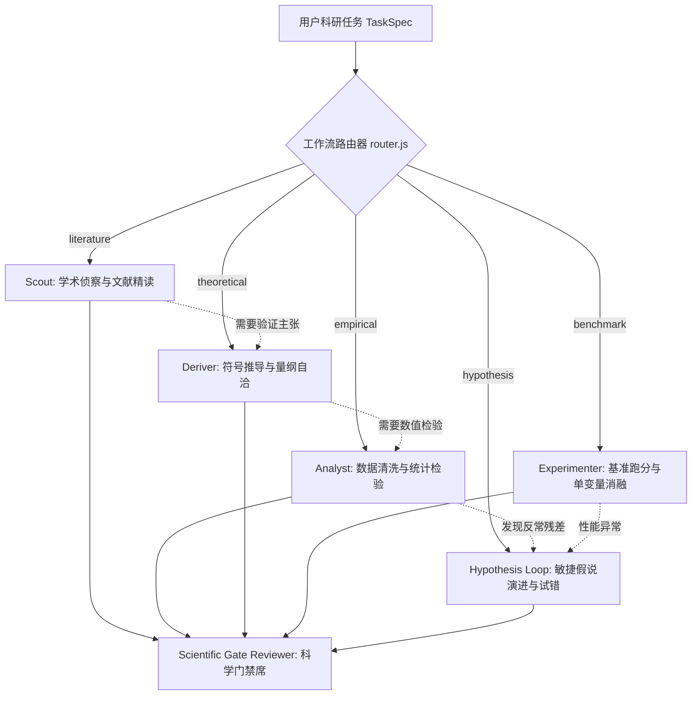

# Tianshu-Research 自适应科研多 Agent 协作与 WorkOrder 规范模版

> 本模版将五大多范式科研矩阵映射至 Tianshu-Harness 原生 `/team` 与 `/council` 编排器。
> **核心原则**：轻量任务默认单 Agent 闭环，绝不小题大做；复杂混合任务仅按需组建专业角色席位，论文撰写与 Council 审查不再是强制默认终点。

---

## 1. 解耦型自适应协作拓扑 (Decoupled Adaptive Topology)

根据任务路由决策（RouteDecision），仅激活必要子图角色，拒绝无脑全员出动：



---

## 2. 角色职责与工单定义 (Role Definitions)

### 2.1 基础单 Agent 场景 (轻量任务首选)
- **规则**：单次数据分析（如清洗单个 CSV 并绘制箱线图）、单一公式量纲校验、单篇 arXiv 论文读卡等短任务，直接在当前主会话中单 Agent 完成，禁止派发 `/team` 团队与子会话。

### 2.2 复杂协作可选角色席位
1. **Analyst (数据与统计分析席)**：
   - 专注数据画像、清洗、效应量与真实置信区间计算。
   - 守卫门禁：`data-quality`、`statistical-validity`。
2. **Deriver (理论推导与量纲席)**：
   - 专注代数演化、极限分析与量纲齐次性审查。
   - 守卫门禁：`dimensional-consistency`、`symbolic-physical`。
3. **Experimenter (代码评测与消融席)**：
   - 专注受控环境运行、单一变量消融与 RunReceipt 抓取。
   - 守卫门禁：`benchmark-validity`、`reproducibility`。
4. **Scout (文献侦察与账本席)**：
   - 仅当明确涉及文献调研时入场，负责 OA 论文初筛与 Locator 精读。
   - 守卫门禁：`literature-grounding`。
5. **Gate Auditor (科学门禁审查席 / Council)**：
   - 审查各项成果是否满足五态门禁规范；Council 是面对重大争议或多方案取舍时的可选仲裁席，绝非每次分析的强制步骤。

---

## 3. WorkOrder 分派示例

针对包含“数据清洗 + 理论极限推导 + 假说检验”的复合型课题，通过宿主派发独立工单：

```json
{
  "orderId": "order_composite_research",
  "paradigms": ["empirical", "theoretical", "hypothesis"],
  "roles": [
    {
      "name": "Deriver",
      "task": "推导控制方程的一维简略形式，并核验在 x->0 处的边界极限",
      "requiredGates": ["dimensional-consistency", "symbolic-physical"]
    },
    {
      "name": "Analyst",
      "task": "处理实测风洞数据并比对理论推导残差",
      "requiredGates": ["data-quality", "statistical-validity"]
    }
  ],
  "budget": {
    "wallSeconds": 600,
    "maxIterations": 3
  }
}
```
